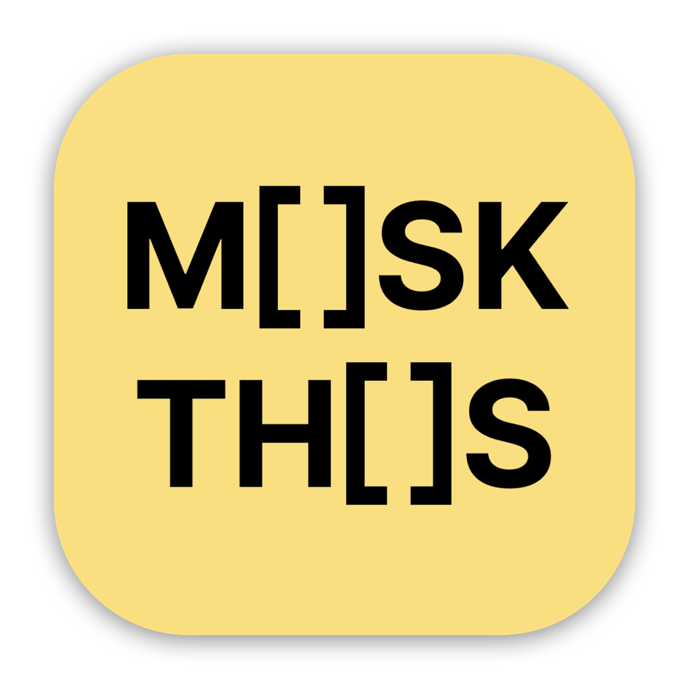

# 

**Mask This** is a macOS menu bar application that uses Apple Intelligence to automatically detect and mask sensitive information in your clipboard in real-time.

### Features

- **Real-time Clipboard Monitoring**: Automatically detects when you copy text to your clipboard.
- **AI-Powered Masking**: Uses Apple Intelligence to identify and hide sensitive data.
- **Privacy First**: Processing happens locally on your device using on-device language models.
- **Menu Bar Integration**: Quick access to settings directly from your macOS menu bar.
- **Customizable Notifications**: Optional notifications to let you know when data has been masked.

### Requirements
- **Apple Silicon Mac**
- **Apple Intelligence** enabled in System Settings.

### How it Works

1. The app runs in the background and monitors the system clipboard for changes.
2. When a new text is copied, the app uses an AI to process the text and mask sensitive information.
3. The masked text is written back to your clipboard.

### Demo

https://github.com/user-attachments/assets/3c77ae3b-f9a8-4c9f-80d5-2ca3cb5c4d4d

